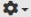

# RIPS: Rapid Intuitive Pathogen Surveillance
RIPS is a dashboard for pathogen surveillance build upon NCBI's Rapid Reports. It helps detect emerging signals from WGS.

The required libraries to run the dashboard are:
```
rvest, httr, Rcurl, dplyr, shiny, data.table, DT, purr, xml2, ggplot2, lubridate, plotly, stringr, tidyr, readr, shinydashboard, shinyWidgets, rintrojs
```
## Setup
  
In R studio, ensure the above libraries are installed. Run the install.R script to quickly install all libraries

Ensure folder www exists and contains the file cfsan_logo_mod.png.

A free NCBI developer's API key is required for making fast and sustainable metadata calls to NCBI. To apply for an API key see:
https://ncbiinsights.ncbi.nlm.nih.gov/2017/11/02/new-api-keys-for-the-e-utilities/

Paste your key into line 22 of the app.R file.

Run the app.R file in R studio. 

## Usage
### Verifying Install:
To verify RIPS is running successfully, click the gear icon on the bottom left , from the 'Data source' drop down select 'test_set1'. Now click the blue button 'Run/Get report for newdate'.
### Quick tutorial:
To get a brief overview of the dashboard, click the gear icon on the bottom left click "Press for instructions" button on the bottom right of the dashboard. 

Step 1: In the top right,  select a taxon and date. Click the blue "Run" button to dowload the selected day's data.

If a report exists for the selected day, a grey popup box will show on the bottom right, indicating the progess of the dashboard. 

An ordered horizontal graph will popup on the center box containing all the clusters.

Step 2: Select a cluster by clicking on it. 

Details of the isolates in the cluster will display in the two seperate table below.

The Focal isolates are the new isolates that triggered the Rapid Report from NCBI.

The Neighbor isolates are isolates closely related to the focal isolates. These are ordered by the difference in age from the focal isolate.These are also ordered by the most recent environmentmal signals followed by the clinicals. 

Blue buttons are clickable and link to searches within the NCBI PD browser.


